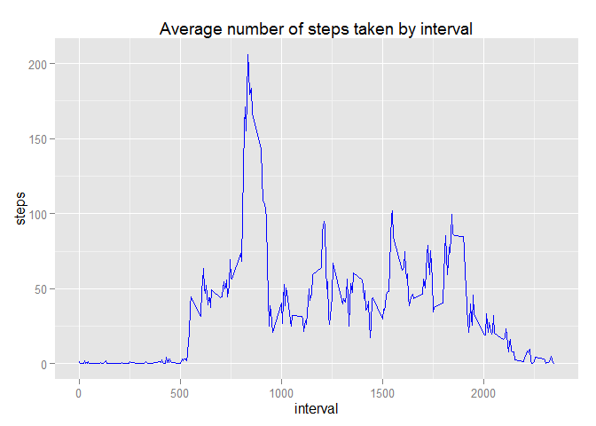
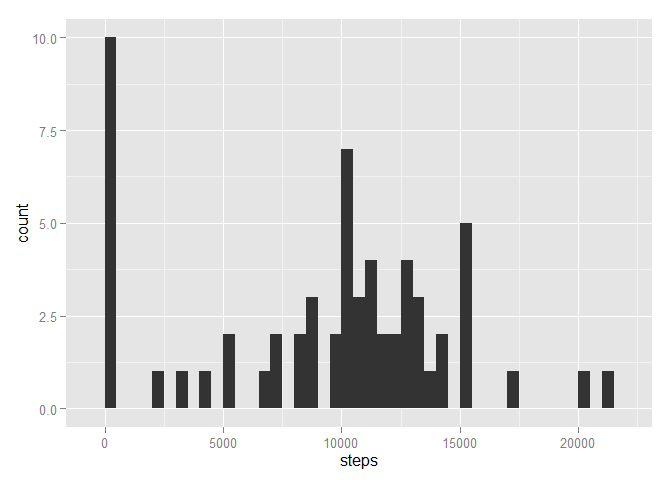
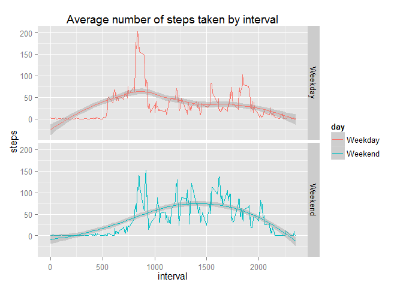

# Reproducible Research: Peer Assessment 1


## Loading and preprocessing the data
We will load the data create a clean version of a data set, which has only rows from the original dataset that are complete (e.g. have no NA values). We also load graphic libraries we are going to use, and set global options

```r
library(knitr)
library(ggplot2)
opts_chunk$set(echo = TRUE, cache = TRUE, cache.path = "cache/", fig.path = "figure/")
# numbers should be shown up to 4 digits precision
options(scipen=1, digits=4)
data=read.csv("activity.csv", header=TRUE)
clean_data=na.omit(data)
nrow(clean_data)
```

```
## [1] 15264
```


## What is mean total number of steps taken per day?
First, using clean dataset (with no missing values), we group the data by date

```r
groupped=aggregate(clean_data$steps, by=list(date=clean_data$date), FUN=sum)
colnames(groupped) = c("date","steps")
```
An extract of groupped dataset

```r
head(groupped)
```

```
##         date steps
## 1 2012-10-02   126
## 2 2012-10-03 11352
## 3 2012-10-04 12116
## 4 2012-10-05 13294
## 5 2012-10-06 15420
## 6 2012-10-07 11015
```
Plot a histogram of number of steps

```r
qplot(steps, data=groupped, geom="histogram", binwidth=500)
```

 

Calculate the mean and median of number of steps taken by date


```r
mean_steps = mean(groupped$steps)
median_steps = median(groupped$steps)
```
**The mean of the total number of steps taken per day is 10766.1887  
The median of the total number of steps taken per day is 10765**

## What is the average daily activity pattern?
We need to group by interval and take the average across the days for this interval

```r
groupped=aggregate(clean_data$steps, by=list(interval=clean_data$interval), FUN=mean)
colnames(groupped) =c("interval","steps")
```
Now do the actual plot

```r
ggplot(groupped, aes(interval, steps))+geom_line(color="blue")+ggtitle("Average number of steps taken by interval")
```

 
Find Which 5-minute interval, on average across all the days in the dataset, contains the maximum number of steps

```r
max_interval = groupped[which(groupped$steps==max(groupped$steps)),1]
```
**Interval 835 contains the maximum number of steps **

## Imputing missing values
First lets calculate the total number of missing values in dataset

```r
total_missing_rows= nrow(data)-nrow(clean_data)
```
**Overall, we have 2304 rows with NA.**

We will replace missing values in number of steps taken with the median of steps in this day.
First lets calculate median per day

```r
medians=aggregate(clean_data$steps, by=list(date=clean_data$date), FUN=median)
head(medians)
```

```
##         date x
## 1 2012-10-02 0
## 2 2012-10-03 0
## 3 2012-10-04 0
## 4 2012-10-05 0
## 5 2012-10-06 0
## 6 2012-10-07 0
```

```r
colnames(medians) = c("date","steps")
```
Now replace the NA values calculated medians. Also note that some days don't have any non-NA values at all, so there would be no entry in medians for such days. For these days, we set number of steps to be 0.

```r
for (i in which(is.na(data))) {
    index_in_medians = which(medians$date==data[i,]$date)
    if (length(index_in_medians)==0) {
      # replace with 0, we have no data at all for this date
      data[i,]$steps=0
    }else{
      median_steps=medians[index_in_medians,2]
      print(median_steps)
      steps=median_steps
    }
}
```
Lets make sure we have no NA left

```r
sum(is.na(data))
```

```
## [1] 0
```
All good!
Using imputed dataset, we group the data by date

```r
groupped=aggregate(data$steps, by=list(date=data$date), FUN=sum)
colnames(groupped) = c("date","steps")
```
Plot a histogram of number of steps

```r
qplot(steps, data=groupped, geom="histogram", binwidth=500)
```

 

Calculate the mean and median of number of steps taken by date


```r
mean_steps_imputed = mean(groupped$steps)
median_steps_imputed = median(groupped$steps)
```
**The mean of the total number of steps taken per day is 9354.2295 and was 10766.1887.  
The median of the total number of steps taken per day is 10395 and was 10765.**
Imputing reduced the estimates of both mean and median.

## Are there differences in activity patterns between weekdays and weekends?
First we create a column to indicate if the day is weekend or weekday


```r
data$date=as.POSIXlt(data$date)
data$day =ifelse(weekdays(data$date) == "Sunday" | weekdays(data$date) =="Saturday","Weekend", "Weekday")
data$day=as.factor(data$day)
```
Lets aggregate by interval and day

```r
groupped=aggregate(data$steps, by=list(interval=data$interval, day=data$day), FUN=mean)
colnames(groupped) =c("interval","day","steps")
```
Create plots for weekend and weekdays

```r
ggplot(groupped, aes(interval, steps, color=day))+geom_line()+geom_smooth(method="loess")+ggtitle("Average number of steps taken by interval")+facet_grid(day ~ .)
```

 

It seems that timer series indeed different for weekends and weekdays - weekdays activity starts earlier (around interval 500), the peak of activity is higher (around 200 vs around 150 steps) and smoothed curve is somewhat different

